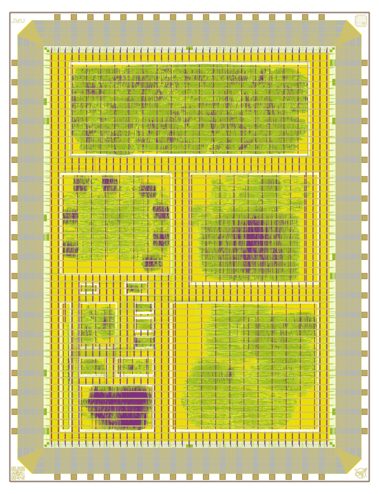

# gf180mcuD - JKU - Projects

Project `JKU1` for wafer.space MPW runs using the `gf180mcuD` PDK.

- [x] **GDS Submission:** https://platform.wafer.space/
- [x] **Precheck:** https://github.com/wafer-space/gf180mcu-precheck
- [x] **Top-Level:** pass; validated violations
  - [x] setup time, max. cap. and max. slew violations &rarr; validated: due to decimator's lower clock of 100kHz
  - [x] hold violations &rarr; fixed with ECO buffers
- [x] **TinyTone:** pass; no violations
- [x] **Decimation Filter:** pass; no violations
  - [x] **N/A Reg to Reg Paths**
  - [x] antenna violations &rarr; fixed with ECO diodes
- [x] **Octowave:** pass; validated violations
  - [x] **setup violation for SS corner**
  - [x] antenna violations &rarr; fixed with ECO diodes
- [x] **TinyWhisper RISC-V:** pass; validated violations
  - [x] **setup violation for SS corner**

- [x] **Tetris:** pass; validated violations
  - [x] **setup violation for SS corner**
  - [x] antenna violations &rarr; fixed with ECO diodes
  
- [x] **TinyStack:** pass; no violations
- [x] **Multiplexer:** pass; no violations
  - [x] **N/A Reg to Reg Paths**

- [x] **TinyBF:** pass; no violations
- [x] **SAR ADC Controller:** pass; no violations
- [x] **LED Spinner:** pass; no violations
  - [x] **N/A Reg to Reg Paths**

- [x] **TinyToneGen:** pass; no violations
  - [x] **N/A Reg to Reg Paths**

- [x] **Digital Filter:** pass; no violations
- [x] **Traffic Light Controller:** pass; no violations
- [x] **VGA Clock:** pass; validated violations
  - [x] **setup violation for SS corner**




## Prerequisites

We use a custom fork of the [gf180mcuD PDK variant](https://github.com/wafer-space/gf180mcu) until all changes have been upstreamed.

To clone the latest PDK version, simply run `make clone-pdk`.

In the next step, install LibreLane by following the Nix-based installation instructions: https://librelane.readthedocs.io/en/latest/installation/nix_installation/index.html

## Implement the Design

This repository contains a Nix flake that provides a shell with the [`leo/gf180mcu`](https://github.com/librelane/librelane/tree/leo/gf180mcu) branch of LibreLane.

Simply run `nix-shell` in the root of this repository.

> [!NOTE]
> Since we are working on a branch of LibreLane, OpenROAD needs to be compiled locally. This will be done automatically by Nix, and the binary will be cached locally. 

With this shell enabled, run the implementation:

```
make librelane
```

This command is also available for the macros.

## View the Design

After completion, you can view the design using the OpenROAD GUI:

```
make librelane-openroad
```

Or using KLayout:

```
make librelane-klayout
```

These commands are also available for the macros.

## Copying important Reports to the Reports Folder

To copy yosys, antenna violations, hold & setup timing and manufacturability reports of the latest run to the `reports/` folder in the root directory of the repository, run the following command:

```
make copy-reports
```

This will only work if the last run was completed without errors. This command is also available for the macros.

## Copying the Design to the Final Folder

To copy your latest run to the `final/` folder in the root directory of the repository, run the following command:

```
make copy-final
```

This will only work if the last run was completed without errors. This command is also available for the macros.

## Copying the final GDS to the GDS Folder

To copy and ZIP your latest GDS in the `final/` folder in the root directory of the repository and save it in the `gds/` folder, run the following command:

```
make copy-gds
```

This will only work if the last run was completed without errors.

## Render Layout of the Design

To render your latest GDS in the `final/` folder in the root directory of the repository and save it in the `img/` folder, run the following command:

```
make render-image
```

This will only work if the last run was completed without errors. This command is also available for the macros.

## Build Macros

To build a specific macro, look into the `Makefile` and run the corresponding command. For example, the following command builds the `tetris` macro:

```
make build-tetris
```

To build all macros, run the following command:

```
make build-all-macros
```

For each macro the following commands are executed: `make librelane`, `make copy-reports`, `make copy-final` and `make render-image`.

## Build All

To clone the PDK, build all macros, build the top-level chip, copy its reports, copy its `final/` folder, copy and ZIP its GDS, render its GDS and display it in the OpenROAD GUI, run the following command:

```
make build-all
```

This is especially useful for people who want to rebuild our chip from scratch. Just clone this repo, run `nix-shell` in the root of this repository and run `make build-all`. Enjoy. :-)

## Verification and Simulation

We use [cocotb](https://www.cocotb.org/), a Python-based testbench environment, for the verification of the chip.
The underlying simulator is Icarus Verilog (https://github.com/steveicarus/iverilog).

The testbench is located in `cocotb/chip_top_tb.py`. To run the RTL simulation, run the following command:

```
make sim
```

To run the GL (gate-level) simulation, run the following command:

```
make sim-gl
```

> [!NOTE]
> You need to have the latest implementation of your design in the `final/` folder. After implementing the design, execute 'make copy-final' to copy all necessary files.

In both cases, a waveform file will be generated under `cocotb/sim_build/chip_top.fst`.
You can view it using a waveform viewer, for example, [GTKWave](https://gtkwave.github.io/gtkwave/).

```
make sim-view
```

You can now update the testbench according to your design.

## Implementing Your Own Design

The source files for this template can be found in the `src/` directory. `chip_top.sv` defines the top-level ports and instantiates `chip_core`, chip ID (QR code) and the wafer.space logo. To allow for the default bonding setup, do not change the number of pads in order to keep the original bondpad positions. To be compatible with the default breakout PCB, do not change any of the power or ground pads. However, you can change the type of the signal pads, e.g. to bidirectional, input-only or e.g. analog pads. The template provides the `NUM_INPUT` and `NUM_BIDIR` parameters for this purpose.

The actual pad positions are defined in the LibreLane configuration file under `librelane/config.yaml`. The variables `PAD_SOUTH`/`PAD_EAST`/`PAD_NORTH`/`PAD_WEST` determine the respective pad placement. The LibreLane configuration also allows you to customize the flow (enable or disable steps), specify the source files, set various variables for the steps, and instantiate macros. For more information about the configuration, please refer to the LibreLane documentation: https://librelane.readthedocs.io/en/latest/

To implement your own design, simply edit `chip_core.sv`. The `chip_core` module receives the clock and reset, as well as the signals from the pads defined in `chip_top`. As an example, a 42-bit wide counter is implemented.

> [!NOTE]
> For more comprehensive SystemVerilog support, enable the `USE_SLANG` variable in the LibreLane configuration.

## Choosing a Different Slot Size

The template supports the following slot sizes: `1x1`, `0p5x1`, `1x0p5`, `0p5x0p5`.
By default, the design is implemented using the `1x1` slot definition.

To select a different slot size, simply set the `SLOT` environment variable.
This can be done when invoking a make target:

```
SLOT=0p5x0p5 make librelane
```

Alternatively, you can export the slot size:

```
export SLOT=0p5x0p5
```

You can change the slot that is selected by default in the Makefile by editing the value of `DEFAULT_SLOT`.

## Building a Standalone Padring for Analog Design

To build just the padring without any standard cell rows, digital routing or filler cells, run the following command:

```
make librelane-padring
```

It is also possible to build the padring for other slot sizes:

```
SLOT=0p5x0p5 make librelane-padring
```

## Precheck

To check whether your design is suitable for manufacturing, run the [gf180mcu-precheck](https://github.com/wafer-space/gf180mcu-precheck) with your layout.
